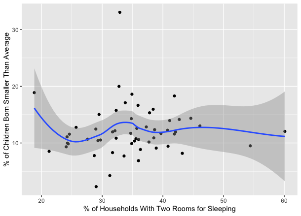
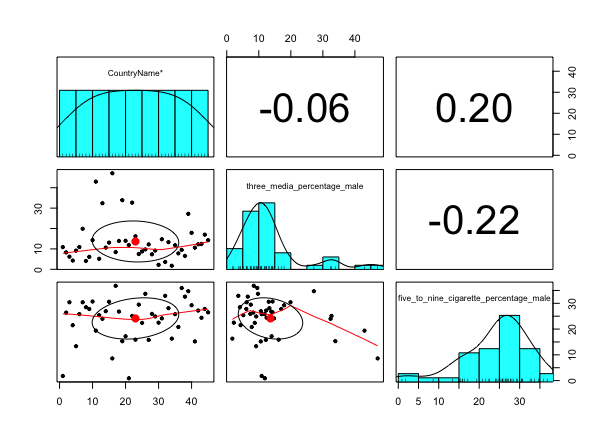

report.md

##### Name(s) :
Nathan Loria, Liam Black

##### Date :
13 December 2021

##### Report Title :
Analyzing Global Public Health Indicators

# Motivation
We chose to do this project because we feel that it is important to realize trends that are happening in the world, and how these trends can lead to better or safer living conditions. In order to conduct our research, we chose four research questions that compared several indicators to each other in order to draw conclusions on the data. The results of the analysis will be explained in this report in detail, and any figures will be provided as well.

# Research Question 1
For this research question, we decided to ask whether there was a correlation between the percentage of men with knowledge of contraception and the average fertility rate among women in specific countries. The dataset consisted of 49 countries in total. We hypothesized that in countries with a lower level of male knowledge on contraception, there would be a higher fertility rate among women in the area. The overall trend can be seen in the following plot.

As can be observed in the plot, there is a general downward trend in the average fertility rate as male knowledge of contraception increases. This would seem to support our hypothesis. A linear model was created to further assess the significance of the question, and this is shown below.
```
Call:
lm(formula = male_contraception_knowledge ~ fertility_rate, data = myData)

Residuals:
    Min      1Q  Median      3Q     Max 
-17.672  -1.021   1.359   2.571   5.455 

Coefficients:
                Estimate Std. Error t value Pr(>|t|)    
(Intercept)    102.08591    2.15842  47.297  < 2e-16 ***
fertility_rate  -0.03907    0.01390  -2.811  0.00717 ** 
---
Signif. codes:  0 ‘***’ 0.001 ‘**’ 0.01 ‘*’ 0.05 ‘.’ 0.1 ‘ ’ 1

Residual standard error: 4.625 on 47 degrees of freedom
Multiple R-squared:  0.144,	Adjusted R-squared:  0.1257 
F-statistic: 7.904 on 1 and 47 DF,  p-value: 0.007173
```
As shown by the linear model, the p-value for the analysis is less than .05, so the null hypothesis can be rejected and our hypothesis is supported. In the following figure, the R^2 value of the correlation can be seen in the bottom right. It turns out to be -0.38.

An R^2 value of -0.38 is slightly less significant than 1.0, however, it still signifies a meaningful negative relationship between the two variables. We believe this to be caused by men that do not have knowledge of contraception being less likely to use it, leading to a higher fertility rate.

# Research Question 2
For this research question, we decided to evaluate the relationship between the average number of children born from women aged 40-49, and the percentage of children born into multiple risk categories. We hypothesized that in countries with a higher average number of children born to women aged 40-49, the percentage of children born into multiple risk categories would be higher. The general trend for the analysis can be observed in the plot below.

As can be observed, the correlation is quite high between the two variables. To further investigate the relationship between the two, a linear model was created with the data. The results of the linear model are shown below.
```
Call:
lm(formula = forty_fortynine_mean_births ~ multiple_risk_birth_percentage, 
    data = myData)

Residuals:
     Min       1Q   Median       3Q      Max 
-1.57575 -0.41090  0.09137  0.43048  1.39000 

Coefficients:
                               Estimate Std. Error t value Pr(>|t|)    
(Intercept)                     1.89531    0.24688   7.677 2.37e-10 ***
multiple_risk_birth_percentage  0.19080    0.01432  13.328  < 2e-16 ***
---
Signif. codes:  0 ‘***’ 0.001 ‘**’ 0.01 ‘*’ 0.05 ‘.’ 0.1 ‘ ’ 1

Residual standard error: 0.6661 on 57 degrees of freedom
Multiple R-squared:  0.7571,	Adjusted R-squared:  0.7528 
F-statistic: 177.6 on 1 and 57 DF,  p-value: < 2.2e-16
```
From this linear model, it can be concluded that the p-value for the analysis is much less than .05, so the null hypothesis can be rejected, and our hypothesis can be accepted. This means that in areas with a higher average number of children born from women aged 40-49, there is a higher percentage of children born into multiple risk categories. The R^2 value for the plot can be seen in the following diagram.

An R^2 value of 0.87 signifies a very strong correlation between the two variables, so it is good to see and this supports our hypothesis even further. We suspect the cause of the relationship to be older women getting pregnant causing more health issues in the children, leading them to be born into these multiple risk categories. Additionally, in countries with lower GDP/Capita, the average number of children born to children aged 40-49 is higher.

# Research Question 3
This question looks at the relationship between the number of rooms in a household and the percentage of child births where the child was smaller than average. We decided to choose this question because we wanted to see if there was a direct correlation between families struggling to house everywhere with enough living space and children at birth not being at typical health standards. Our hypothesis was that if the percentage of households that had two rooms for sleeping was low, meaning potentially only one room for sleeping, then that would correlate to higher percentages of children being born underweight. For this question we utilized a standard graph with a line of best fit, a correlation plot and a linear model. 

Our ggplot showed that there was a cluster of points in the center area of the graph with some outliers on each side as well. Without the line of best fit we inferred that there may be a positive correlation between the two variables. However, after implementing the line of best fit, it displayed that there was no real correlation. To back these findings up we ran a linear model to see the exact p value. The p-value was noted at .722 meaning that we will reject our hypothesis and accept the null hypothesis as any p -value greater than .05 means there is no significant relationship between the two variables. 
```
Residuals:
    Min      1Q  Median      3Q     Max 
-16.585  -4.987   0.045   3.909  25.267 

Coefficients:
                    Estimate Std. Error t value Pr(>|t|)    
(Intercept)         33.83730    2.98661  11.330 6.86e-16 ***
smaller_live_births  0.08266    0.23113   0.358    0.722    
---
Signif. codes:  0 ‘***’ 0.001 ‘**’ 0.01 ‘*’ 0.05 ‘.’ 0.1 ‘ ’ 1

Residual standard error: 7.612 on 54 degrees of freedom
Multiple R-squared:  0.002363,	Adjusted R-squared:  -0.01611 
F-statistic: 0.1279 on 1 and 54 DF,  p-value: 0.722
```
Also when looking at our linear model the Multiple R-squared value came out to me .002363 meaning that .2% of our data was manipulated by these variables showing there was no significant relationship here. As to why this may have occurred, we believe that these variables may be too separate than we previously believed. 

We assumed at the start that if a family doesn’t have enough room for everyone to get their own room, that they may be struggling financially, and on top of that may not have the resources to take care of themselves and their children, which could result in less than average size in child births. However, this was not the case as there were times where the points lined up with our hypothesis, and there were times where the points didn’t match our hypothesis, and it is important as data analysts to note these differences.

# Research Question 4
This question looks at the relationship with access to media and smoking rates in males who smoked 5-9 cigarettes the day before the survey. We chose this question because as people who grew up in America we have been surrounded by the media our entire lives. Growing up without a tv or a phone doesn’t even seem real to me. Specifically, seeing ads on cigarettes has something that has always been on a constant rise within any form of media. These ads give real stories and show the real dangers of smoking in an attempt to get people to quit. Since this data set uses data from many countries we wanted to see that if these men had access to media what would their smoking rates look like. We hypothesized that if men had access to media then the percentage rate of men smoking 5-9 cigarettes a day would be smaller and show a negative correlation on our plots and models. We used three ways to display our data for this question. 

We first used a ggplot to give us an idea of where our points would line up on a graph. After putting the points in we coded a line of best fit so we could get a computer reading of our graph to make inferences if there was a significant relationship. The line of best fit showed an increasing trend into a decrease, into another small increase and then finally decreasing until the end of the seen graph. With most of the points being clustered around the left side of the graph where there was an increasing and decreasing trend, and many outliers all around we decided we would need to look at the physical p-value to get accurate readings.
```
Residuals:
    Min      1Q  Median      3Q     Max 
-14.064  -5.815  -1.707   1.232  29.162 

Coefficients:
                                       Estimate Std. Error t value Pr(>|t|)    
(Intercept)                             20.3112     4.7488   4.277 0.000104 ***
five_to_nine_cigarette_percentage_male  -0.2759     0.1870  -1.476 0.147276    
---
Signif. codes:  0 ‘***’ 0.001 ‘**’ 0.01 ‘*’ 0.05 ‘.’ 0.1 ‘ ’ 1

Residual standard error: 9.939 on 43 degrees of freedom
Multiple R-squared:  0.04821,	Adjusted R-squared:  0.02608 
F-statistic: 2.178 on 1 and 43 DF,  p-value: 0.1473
```
To do this we created a linear model and specifically zoned in on our multiple r-squared and p-value. The p-value was denoted as .1473 meaning that our results were actually not significant. Our multiple r squared showed up as a 4% variance in the graph due to the variables. This concluded that there was not a direct relationship with access to TV and newspaper, and the amount smoked by males in this survey. Even though we inferred that media and smoking rates have a negative correlation to each other our results show that there might be more to this story.

As data analysts we realized it's important to note that there are so many factors that can affect the relationship between two variables. For example, we realized that just because these men have better access to media or watch/read media more doesn’t mean that they are seeing the same rates of anti-nicotine ads as other countries might have. This explains why we saw positive and negative increases in our data for men who had the same access to media. In the future we concluded a better study may be to look at anti-nicotine add rates in countries and smoking rates, that might give a different result than our findings here.

# Conclusion
When we first started this project and chose our variables for our research question we assumed that each question's variables  would be significant to each other. We tried to choose questions that we believed would yield p-values less than .05 every time. Surprisingly we found out that is not always the case. By seeing that two of our research questions actually displayed no correlation it taught us that just because there is no correlation in our data doesn’t mean that the data isn’t helpful to analyze and share with other people. Finding data that doesn’t match your original hypothesis actually made us have to look deeper and ask ourselves why our inferences did not match our results. This project gave us helpful learning strategies as data analysts by showing us how to  discover answers to research questions with both significant and non-significant data.
